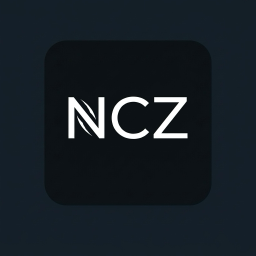
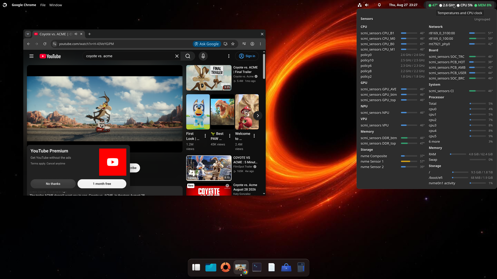
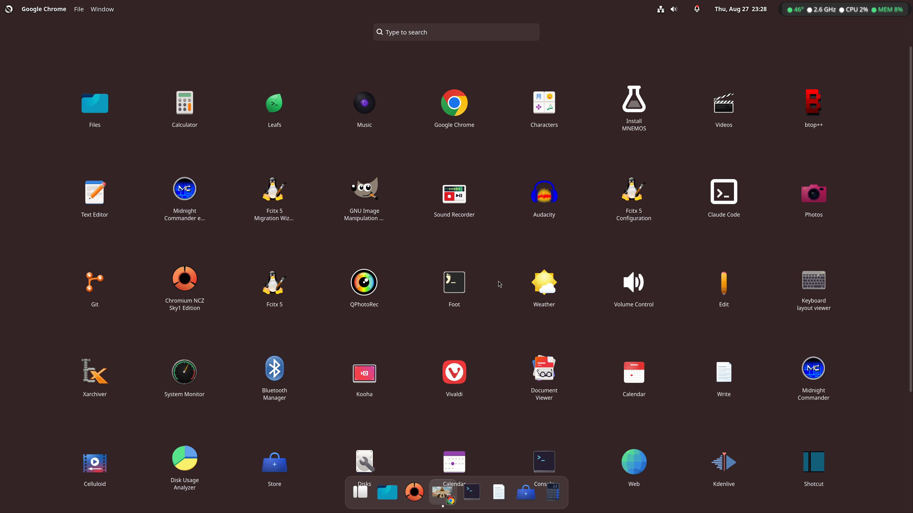
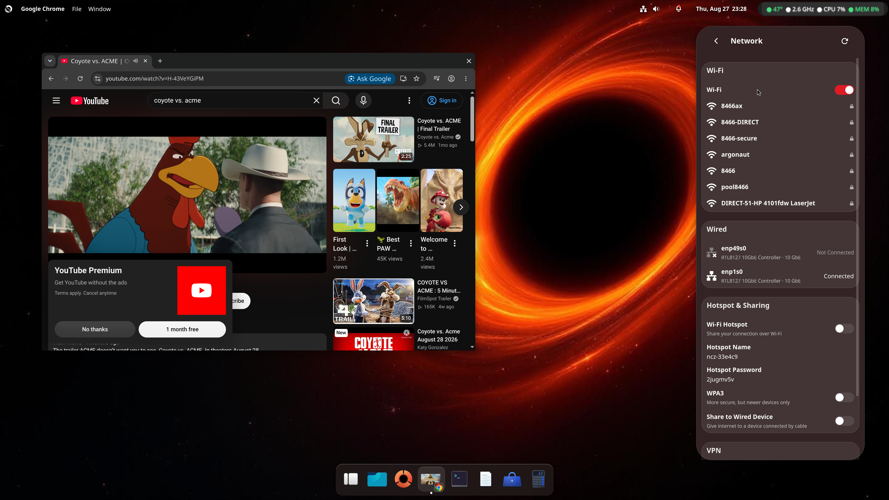
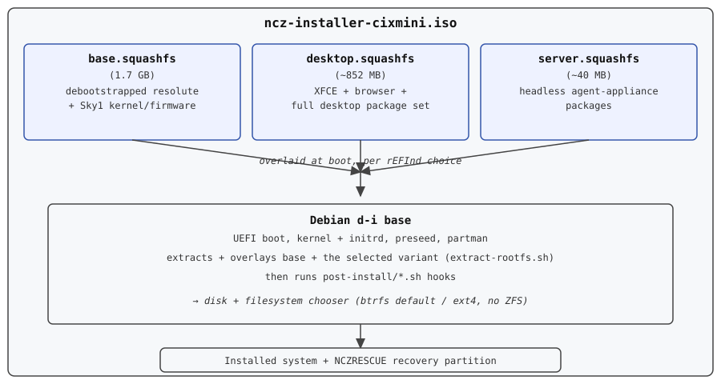

<p align="center">
  
</p>

<h1 align="center">NCZ-OS</h1>
<p align="center"><em>Arm64 Linux for CIX Sky1 — GPU, VPU and NPU that actually work</em></p>

# cix-installer

> **🌐 Language:** English · [简体中文](README.zh-CN.md)
>
> **📚 Start here:** [Design rationale — why it is built this way](docs/DESIGN-RATIONALE.md) · [AI/ML Stack Reference](docs/AI-ML-STACK.md) ([中文](docs/AI-ML-STACK.zh-CN.md)) · [Source releases](docs/SOURCE-RELEASES.md) · [Download the ISO](https://gitlab.com/ncz-os/cix-installer/-/releases/permalink/latest)

**Customized debian-installer ISO builder for the NCZ Linux
distribution.**

Produces a fully-unattended UEFI-bootable installer ISO that
partitions the target disk and debootstraps a **Debian Testing
(Forky)** base on disk, then
layers a hardware-appropriate kernel + vendor userspace runtimes +
desktop environment + Claude Code + the (opt-in) NCZ agent stack, and
brands the system as NCZ.

> **NCZ-OS 26.7 "Maximilian"** ships the **Singularity** desktop
> (labwc/wlroots, native Mali GLES) — X11/XFCE is fully removed — on a single
> kernel, `7.2.0-sky1-ncz`. Validated on Radxa Orion O6N and Minisforum MS-R1;
> Orange Pi 6 in progress.
>
> **Latest release:** [2026.08.27-v14](docs/releases/2026.08.27-v14.md) ·
> [Download](https://gitlab.com/ncz-os/cix-installer/-/releases/permalink/latest)

> ### Remote access defaults
>
> NCZ-OS is built for **home users, hobbyists and lab benches**, and its
> defaults reflect that: **telnet (port 23)**, a failsafe root console on
> **2323**, SSH with password auth and root login, and a recovery container
> that takes **its own IP on your LAN**. They exist so a board you have just
> broken is still reachable — several of these machines are headless with no
> usable serial console.
>
> On a home LAN behind a router we do not consider this a meaningful exposure.
> **In an enterprise, on a shared network, or on anything with a routable
> address, turn it off** — one command, below.
>
> **→ [docs/REMOTE-ACCESS.md](docs/REMOTE-ACCESS.md)** — exactly what is
> enabled, why, and how to disable each part.

## Screenshots

<p align="center">
  
</p>
<p align="center"><em>Singularity desktop (labwc/wlroots) — Chromium and the system sensor panel, showing live CPU/GPU/NPU/VPU temperatures, per-core clocks, network, memory and storage.</em></p>

<p align="center">
  
</p>
<p align="center"><em>The app launcher — GTK4-native apps, dev tooling (Git, Claude Code), and system utilities.</em></p>

<p align="center">
  
</p>
<p align="center"><em>Network settings — Wi-Fi, wired connections, and hotspot sharing.</em></p>

### Why this exists, and why it is built this way

Short version: NCZ-OS targets ARM systems whose GPU, VPU and NPU are the point
— not a board-support layer with a desktop bolted on, and not a lightweight
desktop ported to new silicon.

Every non-obvious decision here (the GPU stack, the codec path, dropping
X/XFCE for Singularity, the base distribution, the initramfs, the release
cadence) was made against a measurement on real Sky1 hardware. Those decisions
and their evidence are written up in full:

**→ [docs/DESIGN-RATIONALE.md](docs/DESIGN-RATIONALE.md)**

Claims there are tagged MEASURED, DECIDED or OPEN, so you can re-litigate them
on evidence rather than taste.

## Vendor-neutral by design

NCZ is **vendor-neutral by design and intent.** Goal: support every
Arm silicon system shipping in the marketplace and every mainstream
x86 platform, when sample hardware is obtainable for validation.

- **Shipping target**: Cix Sky1 / CP8180 — **Radxa Orion O6N** and
  **Minisforum MS-R1**, both metal-validated. This is where the build path is
  most exercised and where the offline-capable proprietary-userspace layer is
  wired in. **Orange Pi 6** validation is in progress. The repo name reflects
  history; the project scope does not.
- **Arm roadmap**: Radxa Qualcomm-platform boards (Snapdragon + Hexagon NPU),
  Rockchip RK3588 / RK3576 family, MediaTek Genio, Apple Silicon (kit-only,
  not OS), and any Arm SoC shipping in volume that we can sample.
- **x86 roadmap**: parallel build path, both **Intel** (CPU + iGPU +
  NPU via OpenVINO 2026.x) and **AMD** (Ryzen / XDNA NPU / ROCm) as
  first-class targets. The build script already takes
  `--platform=x86_64`; only adapter-level work is gated.
- **Embedding inference**: handled by `mnemos-embedkit`
  (https://github.com/mnemos-os/mnemos-embedkit) — vendor-agnostic
  Python kit that auto-detects the highest-tier accelerator (NPU >
  GPU > CPU) at runtime. Same `Engine.auto()` call works on every
  silicon path.
- **Agent runtimes**: side-by-side selectable and **fully opt-in — none is
  installed or active by default.** Run `ncz` (or `ncz agent install <name>`)
  to install `zeroclaw`, `openclaw`, `hermes`, or `portainer`, `ncz install
  nemoclaw` for NVIDIA NemoClaw, and `ncz install mnemos` for the MNEMOS memory
  system. Nothing agentic auto-starts at boot or auto-pulls from the network.

The current build path inside `build/build-iso-di.sh` is the Cix Sky1
implementation; the architecture is the reusable scaffold.

## Hardware support & testing status

<p align="center">
  
</p>


> **Read this before you flash anything.** NCZ is vendor-neutral *by
> design*, but "designed to support" is not the same as "tested on." Here
> is the honest state of hardware validation.

| Board | SoC | Status |
|---|---|---|
| **Minisforum MS-R1** (32 GB, and 64 GB "jumbo") | Cix Sky1 / CP8180 | ✅ **Verified working** on `7.2.0-sky1-ncz`. UEFI boot, the installer, GPU (Mali `mali_kbase`), NPU (Zhouyi embeddings), VPU, audio and networking validated on this box. |
| **Radxa Orion O6** | Cix Sky1 | ⚠️ **Not directly tested by us — user-reported working.** Hardware-closer to the MS-R1 than the O6N is; users have confirmed install and boot on their own O6 boards, including the Realtek NIC (RTL8125/8126) working out of the box via the `rtl_nic` firmware shipped in both the installer and the installed system. We have not put our own hands on an O6. |
| **Radxa Orion O6N** (48 GB) | Cix Sky1 | ✅ **Verified working — our primary dev/debug target**, on `7.2.0-sky1-ncz`. Same Sky1 SoC, O6 board family. The Mali `mali_kbase` GPU driver port and the full Singularity desktop stack were built and validated here. Install, boot, GPU (GLES 3.2), NPU (~95 ms/256-token embed), VPU (H.264/HEVC encode + 8 decode formats), audio and 2.5 GbE all confirmed on the shipping image. |
| **MetaComputing AI PC** — Arm mainboard for Framework Laptop 13 | Cix Sky1 / **CP8180** | ⏳ **Untested, but the same SoC we ship on.** MetaComputing's CP8180 mainboard drops into the Framework Laptop 13 chassis: 12-core Armv9 (Cortex-A720 + A520, up to 2.6 GHz), 10-core Mali GPU, ~45 TOPS NPU, 16/32 GB RAM, from $549. Same silicon as the MS-R1 and O6N, so the kernel, GPU/VPU/NPU drivers and userspace should carry over; the unknowns are laptop-specific — panel/eDP, battery and thermals, lid/suspend, and the Framework EC. **No hardware in hand — testers welcome.** Note the 28 W TDP against a 55 Wh battery. |
| **Orange Pi 6** (Cix variant) | Cix Sky1 | ⏳ **Validation in progress — hardware arriving.** Expected within two weeks of 2026-08-18. The radio firmware added in installer v12 (`firmware-brcm80211`, `firmware-mediatek`, `firmware-atheros`, `firmware-iwlwifi`) exists partly to cover whatever WiFi/BT module this board ships. |
| Other Arm (RK3588/RK3576, MediaTek Genio, Snapdragon) and x86 (Intel, AMD) | — | 🗺️ Roadmap / adapter-level only — not built or tested yet. |

**What "untested" means for you:** parts of the build path are MS-R1-specific
— e.g. an ACPI SSDT override that works around the MS-R1 *factory BIOS bug*
(it omits `_HID="CIXH4010"` so the NPU cores never enumerate), firmware blob
paths, and board/device-tree quirks. On any other board it may not boot, the
NPU/GPU/VPU may not initialize, or the installer may need board-specific work.
**Testers and donated hardware are the fastest way to change a ❌ to a ✅.**

### Driver support matrix — MS-R1 / O6 / O6N

> **Which kernel is this table about?** NCZ-OS 26.7 ships **one** kernel:
> `7.2.0-sky1-ncz` (`linux-cix-sky1-ncz`, corresponding source in
> [`kernel-source/`](kernel-source/SOURCE.md)). The earlier
> `7.0.12-cix-sky1-next` channel has been **removed from the image** — it is
> not a fallback and not a rescue kernel.
>
> **Both GPU drivers ship.** `mali_kbase` (CIX vendor DDK, `cix-gpu-kmd`) is
> the default and provides GLES 3.2 and OpenCL via `libmali`. `panthor`
> (mainline open driver, `panthor-cix`, the Vulkan/PanVK path) is installed
> alongside it and selectable. Both are blacklisted in
> `/etc/modprobe.d/ncz-gpu-drivers.conf` so neither binds by accident; switch
> with `ncz-gpu-select`. See
> [7.2 (Mali) GPU driver notes](#gpu-drivers-and-boot-options).

Sky1 boots via **ACPI, not a device tree** — `/sys/firmware/devicetree/base`
is empty on both the MS-R1 and (per operator reports) Orion O6. There is no
`sky1-orion-o6.dtb` shipped or needed; an earlier revision of this table
claimed one existed in `assets/kernel/` — it doesn't, and never has for this
kernel line.

| Subsystem | Driver | Config | MS-R1 | O6 | O6N | Notes |
|---|---|---|---|---|---|---|
| **Clock** | `clk-sky1-acpi` | `=y` | ✅ | ✅ | ✅ | ACPI clock infra (patch `0003`); base SoC infra in `0002`. |
| **Reset** | `reset-sky1` | `=y` | ✅ | ✅ | ✅ | Reset controllers + ACPI lookup table (patch `0004`). |
| **Pinctrl** | `pinctrl-sky1` | `=y` | ✅ | ✅ | ✅ | Patch `0007`. |
| **Mailbox** | `cix-mbox` | `=y` | ✅ | ✅ | ✅ | ACPI support + channel lookup (patch `0005`). |
| **SCMI** | `arm-scmi` (clock + perf + power + sensor domains) | `=y` | ✅ | ✅ | ✅ | ACPI boot support (patch `0006`); `CONFIG_ARM_SCMI_PERF_DOMAIN=y`, `CONFIG_ARM_SCMI_POWER_DOMAIN=y`. |
| **Thermal** | `cix-thermal` + IPA + cpufreq | `=y` | ✅ | ✅ | ✅ | Patch `0017`. |
| **DSP** | `cix-dsp` + `cix-dsp-rproc` | `=m` | ✅ | ✅ | ✅ | Remoteproc + rpmsg (patch `0019`); confirmed loaded (`cix_dsp_rproc`) on real Sky1 hardware (MS-R1). |
| **Audio (HDA)** | `snd-hda-cix-ipbloq` + Realtek ALC codecs | `=m` | ✅ | ✅ | ✅ | Patches `2015`–`2017`. Verified ALC269VC analog + digital + HDMI/DP on real hardware (MS-R1). |
| **Audio (SoC)** | `snd-soc-sky1-sound-card` + Cadence I2S + `snd-soc-sof-cix` | `=m` | ✅ | ✅ | ✅ | Patch `2014`. SOF (`CONFIG_SND_SOC_SOF_CIX_TOPLEVEL=y`, `CONFIG_SND_SOC_SOF_CIX_SKY1=m`) is built but not observed loaded on real hardware — the machine driver (`snd-soc-sky1-sound-card`) handles audio directly; SOF appears to be a dormant/fallback path, not confirmed active. |
| **GPU (Mali-G720)** | `mali_kbase` (default) **and** `panthor`, both DKMS; `drm-cix` + `drm-trilin-dp-cix` (DisplayPort) | DKMS | ✅ | ✅ | ✅ | **Both drivers ship**, both blacklisted, one selected via `ncz-gpu-select`. Default `mali_kbase` measured on O6N: Mali-G720-Immortalis, 10 cores, **OpenGL ES 3.2 / EGL 1.5**, desktop accelerated. `panthor` is the mainline/Vulkan path. Display: `trilin_dpsub` + `linlon_dp` confirmed, DP up to 4K60. |
| **VPU (Linlon MVX)** | `amvx` via `cix-vpu-driver` (DKMS) | DKMS | ✅ | ✅ | ✅ | Measured on O6N: **Linlon v5276, 4 cores**. Decode H.263/H.264/HEVC/MPEG-2/MPEG-4/VP8/VP9/AV1; hardware encode H.264/HEVC/VP8/VP9 confirmed via `ffmpeg` V4L2 mem2mem. Requires the 16 `*.fwb` codec blobs staged by `post-install/12-sky1-firmware.sh`. |
| **NPU (Zhouyi V3)** | `aipu` via `cix-npu-driver-dkms` 6.2.0 | DKMS (`CONFIG_ARMCHINA_NPU=n`) | ✅ | ✅ | ✅ | Measured on **both** O6N and MS-R1: `nomic-embed-text-v1.5_256.cix` at **95.5 ms** per 256-token embed, deterministic across runs, `aipu` IRQ count advancing. The in-tree `armchina-npu` driver is superseded by the 26Q2-SDK DKMS driver. Requires a model package (`ncz-model-nomic-embed`); models are not on the ISO. |
| **Ethernet** | `r8169` (RTL8125/8126/8169) | `=y` | ✅ | ✅ | ✅ | `rtl_nic` firmware shipped in installer + installed system. `CONFIG_R8169=y` (built-in, not a module). |
| **Wi-Fi** | `mt7921e` (MediaTek MT7921/MT7922) | `=m` | ✅ | ✅ | ✅ | M.2 Key-E slot; confirmed loaded on real hardware (MS-R1). |
| **Wi-Fi (alt)** | `rtw88`/`rtw89` firmware | `=m` | ✅ | ✅ | ✅ | If equipped (`rtw8852b`, `rtw8822`, etc. firmware shipped). |
| **PCIe / USB / PHY** | `pcie-cadence`, `usb-cdnsp`, `phy-cix-usbdp`, `phy-cix-pcie` | `=y` | ✅ | ✅ | ✅ | Patches `0008`/`0009`/`0010`. |
| **USB Type-C (data)** | `xhci-hcd`, `usb-cdnsp` | `=y` | ✅ | ✅ | ✅ | **Works.** The Type-C ports carry USB data normally — a USB-C drive attached to an O6N enumerates and works on 7.2. Data goes through the xHCI/Cadence USB controller, which is entirely independent of the PD driver in the row below. |
| **USB Type-C (Power Delivery)** | `rts5453` (built-in) | `CONFIG_TYPEC=y` | ✅ | ✅ | ✅ | **Works.** Measured on O6N: the driver binds (`rts5453 i2c-CIXH200D:00: port 0: register partner`), `/sys/class/typec/port0` reports `usb_power_delivery_revision 3.0`, `usb_typec_revision 1.2`, `power_role [source]`, `vconn_source yes`. **Note:** `module_blacklist=typec_rts5453,rts5453` still appears on the boot cmdline and is **inert** — the driver is built in, and `module_blacklist` only affects loadable modules. It is a leftover from an earlier kernel where the driver reportedly hung boot on an IRQ-151 conflict; that does not reproduce on 7.2. |
| **IOMMU/SMMU** | `arm-smmu-v3` | `=y` | ✅ | ✅ | ✅ | Confirmed loaded on real hardware (MS-R1). |
| **GPIO / I2C / DMA / PWM / Syscon / Regulator / Timer / IRQ** | Sky1 misc peripherals | mixed | ✅ | ✅ | ✅ | Patch `0018` (misc peripherals) + `0021` (firmware/pinctrl ACPI gaps). |
| **SoC ACPI resource lookup** | `cix-acpi-resource-lookup` | `=y` | ✅ | ✅ | ✅ | `CONFIG_CIX_ACPI_RESOURCE_LOOKUP=y` confirmed; folded into patches `0002`/`0008`, not a standalone `9007`-style patch. |

The MS-R1 column reflects real-hardware confirmation carried forward from the
kernel line this project was originally built on. **O6N is now separately and
heavily validated on the shipping 7.2 kernel** — see **Hardware support &
testing status** above. Treat the O6N marks in this table as "same SoC family,
confirmed at the system level" rather than independently re-verified
driver-by-driver.

**Boot requirements.** Boot is ACPI-based; there is no DTB, and the same
kernel and firmware set serves MS-R1 and Orion O6/O6N alike. The firmware that
must be present is `rtl_nic` (RTL8125/8126), `mali_csffw.bin` (Mali-G720), the
NPU firmware consumed by the `aipu` DKMS module, and the VPU firmware consumed
by `amvx`. The installer writes the ACPI kernel command line into the rEFInd
entry automatically:

```
acpi=force efi=noruntime arm-smmu-v3.disable_bypass=0 clk_ignore_unused panic=30
```

### GPU drivers and boot options

NCZ-OS ships **two GPU drivers** and lets you pick one at boot. Both are
installed; neither loads automatically.

| Boot entry | Driver | Provides | Status |
|---|---|---|---|
| **NCZ-OS** (default) | `mali_kbase` — CIX vendor DDK | OpenGL ES 3.2, EGL 1.5, OpenCL via `libmali` | Metal-validated on O6N and MS-R1. This is what the desktop runs on. |
| **NCZ-OS (Panthor)** | `panthor` — mainline open driver | Vulkan and OpenCL via Mesa PanVK / rusticl | Experimental on Sky1. |

Both drivers claim the same device, so `/etc/modprobe.d/ncz-gpu-drivers.conf`
blacklists **both**. The boot entry decides which one is bound, and
`ncz-gpu-select` switches an installed system without a reinstall.

**What each costs you.** `mali_kbase` gives the accelerated desktop but
exposes **no Vulkan entrypoint** — `libmali` has none. `panthor` is the route
to Vulkan and is where the ecosystem is heading, but on Sky1 it is still
working through enumeration: the board boots via ACPI rather than device tree,
and mainline panthor has no `.acpi_match_table`.

Neither is going away. Shipping only the vendor blob would leave the
distribution with no open successor; shipping only panthor would mean a
desktop that does not accelerate today.

### Every accelerator driver is a DKMS module

This is a deliberate rule, not an accident of packaging:

| Accelerator | DKMS package | Module |
|---|---|---|
| GPU (default) | `cix-gpu-kmd` | `mali_kbase` |
| GPU (alternate) | `panthor-cix` | `panthor` |
| VPU | `cix-vpu-driver` | `amvx` |
| NPU | `cix-npu-driver-dkms` | `aipu` |

**Why DKMS rather than in-tree.** A kernel upgrade rebuilds a DKMS module
against the new kernel. An in-tree module that ships as a prebuilt binary is
locked to one `vermagic` and silently stops loading the moment the kernel
moves — you get a booting system with a dead accelerator and no obvious cause.

It also decides conflicts predictably. Where an in-tree driver and an
out-of-tree one both match the same hardware, DKMS installs to
`updates/dkms/`, which `depmod` prefers, so the intended driver wins rather
than whichever the kernel happened to build. The in-tree `armchina_npu` is
disabled outright (`CONFIG_ARMCHINA_NPU=n`) for the same reason: the vendor's
26Q2 SDK driver is newer than the in-tree one and must not be shadowed by it.

The corresponding source for every one of these is published — see
[docs/SOURCE-RELEASES.md](docs/SOURCE-RELEASES.md).

## Quick start (build the ISO)

```bash
make
# → outputs: build/nclawzero-installer-cixmini-${VERSION}.iso
```

### Build-host prerequisites

The `make iso` (and `make download`) targets need a Linux host with at least:

- Debian 13+ (or Ubuntu 24.04+) — `bash`, GNU coreutils, GNU `find` (with
  `-print0`), GNU `cpio`, GNU `xorriso` (>= 1.5), `python3`, `dpkg-dev`
- `acpica-tools` — provides `iasl`, which compiles `assets/npu/ssdt-npucre.asl`
  into the early-initramfs SSDT CPIO that fixes the Minisforum MS-R1's missing
  `_HID="CIXH4010"` on the NPU compute cores. Without it, the build fails
  loudly (see `build/npu-ssdt-gate.sh`, called from `build/build-iso-di.sh`'s
  full-mode preflight). On Debian / Ubuntu:

  ```bash
  sudo apt install -y acpica-tools
  ```

The MS-R1 NPU is invisible to the kernel without this override (no
`CIXH4010:00..02` platform devices → no `/dev/aipu`). Measured on real
hardware (r251 kernel, .66 MS-R1): with the override prepended to
`/boot/initrd.img-$KVER`, the dmesg is
`armchina CIXH4000:00: sky1_npu_probe: NPU core num is 3 → AIPU KMD (v6.2.0)
probe start... → AIPU detected: zhouyi-v3` and all three cores enumerate.
The .asl source is committed at `assets/npu/ssdt-npucre.asl`; the generated
`.cpio` is regenerated from source by `build/build-npu-ssdt.sh` (called from
`build/stage-canonical-assets.sh`, which runs automatically in `--mode full`).

### Validating the NPU SSDT wiring

A fast standalone check that the assets/npu/ tree is consistent (the .asl
source compiles, the .cpio is present, the CPIO is in uncompressed newc
format, the inner AML is a valid SSDT) — no full ISO build required:

```bash
# Regenerate the CPIO from the committed .asl if it is missing or stale,
# then run every check:
bash build/npu-ssdt-gate.sh --regen

# Or, after a successful build, just verify without regenerating:
bash build/npu-ssdt-gate.sh

# Self-test the gate itself (runs 6 cases in an isolated temp tree, never
# touches the production assets/npu/). Needs iasl. Use to validate the
# gate before relying on it.
bash build/npu-ssdt-gate.sh --self-test

# Same checks, wired as Make targets so CI / build hosts can `make` them:
make npu-ssdt-check           # production-tree validation
make npu-ssdt-check regen=1   # allow the gate to auto-rebuild missing CPIO
make npu-ssdt-selftest        # self-test the gate (6 isolated cases)
```

The gate exits 0 on PASS and 1 on FAIL with an explicit remediation per
failure mode (missing .asl, missing .cpio, bad magic, missing entry,
unrecognised inner AML signature, or missing iasl). It is the same gate
`build-iso-di.sh` invokes in its full-mode preflight, so a PASS here
guarantees a clean `make iso` run.

## Quick start (install on hardware)

> **Connect wired Ethernet before powering on.** Wi-Fi is not available in the
> installer, and with no link detected the installer stops with "Network
> autoconfiguration failed" (plug in a cable and Retry) rather than looping
> silently.
>
> The base system itself comes off the image, so there is no network-dependent
> package resolution mid-install to fail on a flaky link or an unreachable
> mirror. That is not the same as fully offline: some post-install steps do use
> apt, and a few optional components fetch from the network. Those are the parts
> a bad link degrades — not the install itself.

1. **Verify the download**, then flash to a USB stick (≥8 GB). Each release
   ships an `.md5` beside the ISO:

   ```bash
   md5sum -c nclawzero-installer-cixmini-<version>.iso.md5
   ```

   Then write it. The ISO is a hybrid image — copy it to the **whole device**
   (`/dev/sdX`), not a partition (`/dev/sdX1`):

   ```bash
   sudo dd if=nclawzero-installer-cixmini-<version>.iso of=/dev/sdX \
        bs=4M status=progress oflag=direct conv=fsync
   sync
   ```

   On macOS the device is `/dev/rdiskN` (note the `r`), and you must
   `diskutil unmountDisk /dev/diskN` first.

   > **`dd` writes to whatever you point it at, without asking.** Confirm the
   > target with `lsblk` immediately before running it. Naming the wrong device
   > destroys that disk.

2. Plug the USB into the target (cixmini / Orion O6/O6N), power on, and hit the
   F-key for the UEFI boot menu to pick the USB device.

   Realtek NICs, including the Orion O6's RTL8125/8126, work out of the box;
   the `rtl_nic` firmware ships in both the installer and the installed system.
3. **Choose your disk and root filesystem.** The installer shows a real
   disk-selection screen (for multi-disk systems) followed by a filesystem
   choice — **btrfs** (default: snapshots + transparent compression) or
   **ext4** (simple, maximally robust). ZFS root is **not** supported yet.
   Both choices can be preset non-interactively via kernel cmdline
   (`ncz_disk=<dev>`, `ncz_fs=<ext4|btrfs>`) for unattended fleets.
4. d-i auto-runs preseed; ~20-30 min unattended install
5. Reboot, remove USB, target boots nclawzero from internal storage

## Architecture

The installer was redesigned around **layered squashfs images** rather than a
live debootstrap-and-apt-install at install time. The motivation was
concrete, not architectural taste: install **speed** (unpacking a pre-built,
pre-configured squashfs is far faster than debootstrap + hundreds of package
postinst scripts running on-device) and **offline reliability** (a squashfs
delta either extracts correctly or it doesn't — there's no network-dependent
package resolution mid-install to fail on a flaky link or an unreachable
mirror, which was a recurring source of install failures under the old
apt-at-install-time model).



**NCZ-OS ships ONE build.** There is no separate desktop and server image,
and no variant picker. What used to be the "Magnetar" server variant is now
simply a **console boot entry** on the same image
(`systemd.unit=multi-user.target`) — same packages, the GUI is just not
started. `ncz desktop off` does the same thing on a running system, and
`ncz desktop on` reverses it.

This replaced a two-variant model (Reinhardt/desktop, Magnetar/server) that
cost a full apt closure and a second squashfs on every build for a difference
that amounts to one systemd target.

The ISO also ships:
- CIX proprietary userspace `.deb`s, staged offline in `assets/cix-debs/`
  (~30 packages after excluding internal test/validation builds that are
  never actually installed) — dpkg-installed by `post-install/25-cix-proprietary.sh`.
  The same package set is **also** mirrored into the Buildkite `ncz-os/ncz`
  apt repo (31 packages, ~81 MB) so it can be re-pulled post-install without
  a reinstall — see [OTA channel](#ota-channel-kernel--driver-updates--persistent-apt-sources).
- The kernel (`7.2.0-sky1-ncz`) with its firmware. Earlier releases also
  carried an older `7.0.12-cix-sky1-next` channel on a dedicated rescue
  partition; that channel has since been **removed from the image**.
- Quadlet definitions for zeroclaw plus optional OpenClaw, Hermes, and
  NemoClaw templates (staged only — none active by default)
- Native KMS boot splash (`singularity-boot-splash`, custom NCZ logo/loading
  bar) — Plymouth is purged entirely; see
  [Why we moved off X/XFCE](docs/HOW-DID-WE-GET-HERE.md#3-the-desktop-xfce-on-x11-to-singularity-on-wayland)

So the install is offline-capable for the Cix layers and **stages** the agent
quadlets + OCI images without activating any of them; every agent (including
zeroclaw) and the MNEMOS memory system are installed on demand by the operator
via `ncz` after install.

## On-device AI: NPU embeddings & inference

<p align="center">
  
</p>


The ISO ships a working **NPU embedding stack** so a freshly-installed
appliance does semantic memory at NPU latency, offline, with no setup. This is
the load-bearing AI workload for MNEMOS (the memory layer) and it is wired to be
**automatic** — the operator never picks a model or an accelerator.

### What's baked into the install

| Component | Lands at | From |
|---|---|---|
| NPU kernel driver (`armchina_npu.ko`, `/dev/aipu`) | kernel + `modules-load.d` | `assets/npu`, `80-npu.sh` |
| NPU userspace (`libnoe.so.0.6.0` + `libnoe`/`NOE_Engine` wheels) | `/usr/share/cix/lib`, `/usr/share/cix/pypi` | `cix-noe-umd 2.0.2`, `25-cix-proprietary.sh` |
| Python 3.11 venv (libnoe wheels are cp311/cp312 only) | `/opt/ncz/embed-venv` | `46-python311.sh`, `47-embedkit.sh` |
| **Embedding model** `bge-small-zh-v1.5_256.cix` (INT8, 512-dim) | `/opt/ncz/models/` | `assets/models`, `47-embedkit.sh` |
| Offline tokenizer | `/opt/ncz/models/bge-small-zh-v1.5/` | `assets/models` |
| GGUF CPU/GPU fallback | `/opt/ncz/models/` | `assets/models` |
| Operator docs (this section's deep dives) | `/usr/share/doc/ncz/` | `assets/docs`, `80-npu.sh` |

The `.cix` is the prebuilt Compass-NN artifact pulled from the Cix
`ai_model_hub` (ModelScope, 26_Q1) and **committed to this repo** so it can
never be lost on reinstall (the failure mode of cixtech/cix-linux-main#21).

### Embedding is automatic

MNEMOS embeds every memory on ingest via `embedkit.Engine.auto()`, which:

1. probes hardware, sees `libnoe` + `/dev/aipu`, selects the `npu-cix` adapter;
2. loads the `.cix` from `/opt/ncz/models/` and tokenizes offline;
3. returns the 512-dim vector for vector search.

No manual embedding step, no per-model wiring. The same `Engine.auto()` call
falls back to CPU/GPU on non-NPU silicon — the kit is vendor-agnostic. Verified
on Sky1: correct semantic retrieval, ~51 emb/s. (Measured on the kernel line that preceded 7.2; not re-measured since.)

### Inference hierarchy (what runs where)

| Workload | Use | Avoid |
|---|---|---|
| Text embeddings (encoder, ≤256 tok) | **NPU** (`.cix`) | GPU compute |
| Long-doc embeddings / LLM decode / dynamic shapes | **CPU** | NPU, GPU compute |
| Vision / CNN (mobilenet, resnet, yolo) | **NPU** | GPU compute |
| Display / desktop GL/Vulkan | **GPU** (panthor) | — |

NPU = fixed-shape encoders, CPU = everything dynamic, GPU = pixels not ML.
Mali-G720 has no cooperative-matrix, so GPU ML compute is 6–47× slower than CPU
— it is wired for display only. Full per-driver matrix with numbers:
[`docs/INFERENCE_LIMITS.md`](docs/INFERENCE_LIMITS.md).

### Pulling more models

`.cix` models come prebuilt from the Cix hub (the Compass compiler is not
public). Pull a single file:

```bash
BASE="https://www.modelscope.cn/models/cix/ai_model_hub/resolve/26_Q1"
curl -fL "$BASE/models/.../bge-small-zh_256.cix" -o model.cix
```

Drop it in `assets/models/`, add a row to `assets/models/MODELS-README.md`,
rebuild. Full guide (single-file + LFS clone + custom ONNX→`.cix`):
[`docs/MODELSCOPE-MODELS.md`](docs/MODELSCOPE-MODELS.md).

### Deep-dive docs (also shipped to `/usr/share/doc/ncz/` on the appliance)

- [`docs/DESIGN-RATIONALE.md`](docs/DESIGN-RATIONALE.md) — **why the stack is built this way**: Mali vs Panthor and how we benchmarked them, the VPU/codec path (FFmpeg, GStreamer, Chromium), Wayland+Singularity, sinty-nm, Debian Forky, dracut
- [`docs/MNEMOS-NPU-EMBEDDINGS.md`](docs/MNEMOS-NPU-EMBEDDINGS.md) — the automatic embedding chain, I/O contract, verification commands
- [`docs/INFERENCE_LIMITS.md`](docs/INFERENCE_LIMITS.md) — full per-HW/driver capability + limits matrix
- [`docs/MODELSCOPE-MODELS.md`](docs/MODELSCOPE-MODELS.md) — pulling/compiling `.cix` models

## AI/ML stack & project history

The full guide to what AI/ML ships on the appliance, what each binary and
library is for, how to route a workload across the four compute engines
(CPU / NPU / GPU / VPU), measured performance, and how to pull new models:

- [`docs/AI-ML-STACK.md`](docs/AI-ML-STACK.md) — AI/ML stack reference
  · [简体中文 (Simplified Chinese)](docs/AI-ML-STACK.zh-CN.md)
- [`docs/HOW-DID-WE-GET-HERE.md`](docs/HOW-DID-WE-GET-HERE.md) — schedule
  post-mortem: the engineering effort behind the first full Linux distro for
  this silicon · [简体中文 (Simplified Chinese)](docs/HOW-DID-WE-GET-HERE.zh-CN.md)


## Inputs

| Path | Source | Notes |
|---|---|---|
| `assets/cix-debs/` | Staged CIX proprietary `.deb`s (gitignored) | Also mirrored into Buildkite `ncz-os/ncz` (31 packages, see OTA channel section) |
| `assets/kernel/{legacy,edge}/` | Yocto build of `meta-cix:linux-cix-sky1-ncz` (7.2, `edge/`) channels (gitignored) | `Image-cixmini.bin` + `modules-cixmini.tgz` + `KVER` per kernel; also has a `modules-overlay/$KVER/` subdir for validated fixup `.ko`s (see `post-install/80-npu.sh`, `81-vpu.sh`, `82-mali-gpu.sh`) — the NCZRESCUE partition boots this same legacy kernel, see `build/build-rescue-rootfs.sh` |
| `assets/agent-stack/*` | This repo | systemd quadlets for zeroclaw/openclaw/hermes/portainer/mnemos/nemoclaw |
| `assets/branding/*` | This repo | os-release, motd, wallpapers, rEFInd banner/icons |
| `preseed/preseed.cfg`, `preseed/late.sh` | This repo | d-i unattended preseed + late_command (pre-chroot, install-time-only) |
| `post-install/*.sh` | This repo | 40+ numbered hooks; run inside the chroot |

## Stages (post-install hooks)

`post-install/run-all.sh` runs the numbered `post-install/*.sh` hooks inside the
chroot, in three phases: required kernel/network hooks (skipped on a baked
image, where the kernel is already in the squashfs), machine-specific hooks
gated by `MACHINE_HOOKS_RE` on a baked image (apt sources, CIX proprietary
userland, GPU pin, agent stack, Python/embedkit, Claude Code, Vivaldi, NPU/VPU
overlays, rescue partition), and the bootloader/diagnostics hooks run from an
`EXIT` trap. This list goes stale fast (it has twice already) — `run-all.sh`
and the individual `post-install/NN-*.sh` files are the source of truth for
exactly what runs and in what order, not a hand-maintained summary here.

## Remote diagnostics (while the installer is booted)

A single, **removable, toggleable** diagnostics module gives a remote operator
full access *while the d-i installer is running*, so an install can never wedge
us out and failures are captured even with nobody watching.

> **🔑 Default login (installer only):** username **`installer`** (or **`root`**),
> password **`diags`**. Override the password at boot with
> `ncz_diag_pw=<pw>` on the kernel cmdline. (LAN-only / testing — see the
> security note below.)

| Channel | Port | Access |
|---|---|---|
| **SSH (password)** | 22 | `ssh root@<host>` — password `diags`. `network-console` + `sshd-watcher.sh` force `PasswordAuthentication yes`/`PermitRootLogin yes`; the module sets root's password so password auth actually works (no key needed). `installer@<host>` (password `diags`) also reaches the network-console menu. |
| **Telnet** | 23 | rich busybox shell (full applet farm: `vi`/`awk`/`sed`/`tar`/`less`/…) from the shipped static arm64 busybox |
| **HTTP (file pull)** | 8080 | `wget http://<host>:8080/var/log/syslog` or browse `http://<host>:8080/` for any installer file (GET-only) |
| **Remote syslog** | 5514/udp | every installer log line (plus `DEBCONF_DEBUG=5` verbose d-i output) shipped to a collector host so you get the failure without logging in |

**Toggle / removal (two independent switches).**
1. **Build switch** — `DIAG_ENABLE=0 build/build-iso-di.sh …` produces a
   **ship-clean** image: the module is not staged and `ncz_diag`/`DEBCONF_DEBUG`
   are not added to the kernel cmdline. (Default `DIAG_ENABLE=1` during bring-up.)
2. **Boot variable** — `ncz_diag=0|off` on the kernel cmdline disables the
   module even if staged; `ncz_diag=1` enables it. Flip it right at the rEFInd menu.

**Tunables (kernel cmdline):**
- `ncz_diag_pw=<pw>` — root/diag password (default `diags`).
- `ncz_diag_log=<host[:port]>` — remote syslog collector (defaults to the
  build's internal dev collector on port `5514`). Point it at your own box.

**How it works.** A static arm64 busybox (`assets/diag/busybox-arm64`, with
`telnetd`/`httpd`/`syslogd`/`klogd`/`chpasswd` compiled in) ships on the CD;
`preseed/early_command` launches `preseed/diag-console.sh` in the background. The
script self-gates on `ncz_diag`, installs a full applet farm for the rich shell,
sets the root password, replaces d-i's syslogd with one that **also forwards to
the collector**, and starts telnetd + httpd — all **idempotent** (pidfile-guarded)
and self-respawning for the whole install. The base d-i initrd has none of these
(`nc`/`wget`/`tftp` only, and `sshd` only after network-console).

**Collector side.** Run `ncz-logd.sh` on your collector host: a `socat` UDP
listener on `:5514` appending to
`~/cixmini-install-logs/install-<date>.log`. `tail -f` it during an install.

**File transfer.** *Pull:* `wget http://<host>:8080/<path>`. *Push:* over SSH,
`cat local | ssh root@<host> 'cat >/tmp/x'` (httpd is GET-only).

On the **installed system**, full SSH (scp/sftp), telnet on :23
(`post-install/36-telemetry.sh`) and telemetry take over; the installer-only
consoles vanish with the d-i ramdisk.

> **Security:** the default password `diags`, unauthenticated-ish telnet root
> shell, and world-readable httpd are **LAN-only / TESTING ONLY**. Ship with
> `DIAG_ENABLE=0` (or `ncz_diag=0`) to strip the whole module in one switch.

### Installed-system access posture (defaults)

- **No diagnostic account on a running appliance.** `post-install/09-diag-account.sh`
  seeds the `magnetar` rescue account so an install / first boot can never lock
  you out, but it is **installer-only**: a first-boot oneshot
  (`nclawzero-diag-selfdestruct.service`) deletes the account and every artifact
  (sudoers drop-in, AccountsService entry, SSH keys, marker) and then removes
  itself. After the first clean boot the delivered system carries **no**
  diagnostic credentials. (If the first boot fails before it runs, the account
  is still there for rescue.)
- **Password SSH auth is enabled by default** on the installed system for
  operator convenience (`PasswordAuthentication yes`). Day-to-day login is the
  operator account you set at install time. To harden a fleet image to key-only,
  set `PasswordAuthentication no` / `PermitRootLogin prohibit-password` in
  `post-install/35-ssh.sh` and re-bake.
- **Hostname** defaults to `ncz-<mac8>` (last 8 hex of the first wired MAC) so
  every box on a LAN is uniquely named; the operator hostname (if set during
  install) always wins. See `post-install/37-ntp-hostname.sh`.

## Rescue partition

Every install gets a dedicated 4 GiB ext4 **NCZRESCUE** partition, populated
at install time by `post-install/72-rescue-partition.sh` from a prebuilt
rescue rootfs (`build/build-rescue-rootfs.sh`, package list in
`manifests/rescue.pkgs`). It boots from its own rEFInd menu entry
("RESCUE PARTITION"), independent of the main root filesystem — if the
installed system's root (btrfs or ext4) won't boot, the rescue partition
still will.

**Login.** Root, password **`rescue`** (LAN-only; the rescue environment is
not meant to be internet-facing). Hostname `ncz-rescue`.

**Access channels:**

| Channel | Port | Notes |
|---|---|---|
| SSH (openssh, password auth) | 22 | `ssh root@<host>` |
| Dropbear (lightweight SSH) | 2222 | Alternative if openssh is misbehaving |
| Telnet | 23 | Full busybox applet shell |
| Serial console | `ttyAMA2@115200` | Direct hardware console, no network needed |

**Networking.** DHCP by default; falls back to a static IP
(`192.168.207.66/24`, gateway `192.168.207.1`) if DHCP fails, so the box is
always reachable on the fleet LAN even with no DHCP server present.

**What's on it.** A genuinely comprehensive recovery toolset (not just a
minimal shell) — cherry-picked from the SystemRescue package list and mapped
to Debian Forky arm64:
- **Filesystems** — btrfs-progs (the actual root fs), e2fsprogs, xfsprogs,
  f2fs-tools, ntfs-3g, exfatprogs, dosfstools, squashfs-tools.
- **Disk/partition** — full `util-linux` (fdisk/lsblk/blkid/wipefs), parted,
  gdisk, nvme-cli, smartmontools, lvm2, mdadm, cryptsetup.
- **Imaging / data recovery** — `ddrescue` (gddrescue), `testdisk` +
  `photorec`, fsarchiver, partclone.
- **Networking** — full iproute2/net-tools stack, tcpdump, socat, netcat,
  iperf3, sshfs, nfs-common, cifs-utils, rclone.
- **Hardware / boot diagnostics** — pciutils, usbutils, dmidecode, lshw,
  efibootmgr, `refind` itself (to repair the main system's `refind.conf`
  from the rescue side), kexec-tools.
- **Kernel/module/initrd repair** — the specific class of failure this
  partition exists for: kmod, initramfs-tools, cpio, device-tree-compiler,
  kpartx, binutils. Two purpose-built helpers ship in `/usr/local/sbin/`:
  `ncz-rescue-fixlib` (repairs a wedged usr-merge `/lib` symlink — the
  failure mode from a botched `tar -C /` extraction) and
  `ncz-rescue-chroot <device>` (mounts a target root + binds `/dev`/`/proc`/
  `/sys` and drops into a repair chroot in one command).
- **Shell/scripting** — vim, nano, tmux, mc, python3, jq.

`/AGENTS.md` on the rescue rootfs documents system facts, the boot model, and
step-by-step recovery procedures for an operator (or an agent) landing in
this environment cold.

## OTA channel (kernel + driver updates) + persistent apt sources

Fielded devices upgrade their kernel and the proprietary CIX drivers **over
standard APT — no reinstall**. `post-install/24-apt-sources.sh` wires the
Buildkite source and refreshes the package index **before any hook that
installs packages**, so every later dependency-resolution step works against
a current index.

**Where packages live.**
- **Debian archive** — `https://deb.debian.org/debian`, suite **forky**
  (Debian Testing), components `main contrib non-free non-free-firmware`,
  arm64. Written by `post-install/23-base-apt-sources.sh` to
  `/etc/apt/sources.list.d/ncz-base.sources` (deb822 format, signed by
  `debian-archive-keyring.gpg`) from the values in `release.conf`. That hook
  also **removes `/etc/apt/sources.list` and deletes any Ubuntu/resolute
  source files**, so Ubuntu Ports is never left as a live fallback on a
  Debian-profiled image. Enabled by default on every image — this was never
  CDROM-only; the "offline-only" doctrine applied to specific single-vendor
  sources (see Vivaldi below), not the base archive.
- **Kernels** — compiled `linux-image-cixmini-{lts,edge}` + `cixmini-boot`
  (`build/build-kernel-debs.sh`) → **Buildkite Packages** signed Debian registry
  `ncz-os/ncz`, wired by `post-install/24-apt-sources.sh`:
  `deb [signed-by=…] https://pub-d7b784e01679403d9c70fcd23fff5b96.r2.dev any main`.
  Buildkite Packages serves over a CloudFront-backed CDN, so `apt update`/
  `apt upgrade` against this source is fast and doesn't depend on any single
  origin server staying up.
- **CIX userspace drivers/runtimes** → the **same** Buildkite `ncz-os/ncz`
  registry (mirrored 2026-07-05 from `archive.cixtech.com`, the upstream CIX
  Debian repo — China-hosted, intermittently refuses connections entirely).
  31 packages, ~81MB, well under the registry's 1.5GB quota; the 5 test/dev-only
  packages that are never actually installed (`cix-unit-test`,
  `cix-npu-onnxruntime`, `cix-ltp`, `cix-gpu-test`, `cix-vpu-test` — 1.6GB
  combined) were excluded. There is no Codeberg apt source for this — an
  earlier revision of this doc described one (`post-install/91-codeberg-apt.sh`)
  that was never actually implemented in this repo.
- **Kernel source + Yocto recipes** → GitLab [`ncz-os/meta-cix`](https://gitlab.com/ncz-os/meta-cix).

The Buildkite source is GPG-signed (`signed-by`, never `trusted=yes`); the
install-media `file:///cdrom` source is stripped post-install, and the previous
GHCR/squashfs OTA (`90-ota-channel.sh`) is retired. The old "CDROM-only, no
persistent apt source" posture (r180 doctrine) is superseded for the sources
above; `52-vivaldi.sh` still neutralizes Vivaldi's own single-vendor
`repo.vivaldi.com` source specifically (a narrower, separate decision).

**How it updates.** On the device, `apt update && apt upgrade` (or
`ncz-update [--apply]`) pulls new kernel + CIX packages from the signed
registries and installs them — moving to a new kernel no longer requires a
full reinstall.

`ncz-update --status` reports the configured image and installed versions without
pulling anything.

## Upstream contributions

Work that started here and went upstream, or is staged to. None of it is
NCZ-specific: the defects are in shared code, so the fixes belong with
their projects rather than in a distribution patch pile.

### Browser and codec: hardware video decode

Getting hardware video decode working in a browser on this silicon took six
patches to the CIX VA-API driver, plus patches to FFmpeg, Firefox and Chromium.
Every one of the four underlying defects failed **silently** — nothing logged
an error — which is why the work is written up with the evidence rather than
just the fix:

- **[docs/HW-VIDEO-DECODE-STATUS.md](docs/HW-VIDEO-DECODE-STATUS.md)** — what
  works, measured by looking at the rendered picture rather than at a proxy
  signal. H.264 1080p and VP9 720p decode in hardware in Chromium (renderer
  CPU ~27% → ~3.5% on H.264); AV1 is blocked upstream.
- **[docs/upstream-patches/cix-vaapi/](docs/upstream-patches/cix-vaapi/)** —
  the six VA-API patches. Without them browser hardware decode does not work
  on this platform at all.
- **[docs/upstream-patches/ffmpeg/](docs/upstream-patches/ffmpeg/)**,
  **[firefox/](docs/upstream-patches/firefox/)**,
  **[chromium/](docs/upstream-patches/chromium/)** — V4L2 M2M decoder support,
  AV1 plumbing and timestamp handling.
- **[docs/upstream-patches/cix-vaapi-repro/](docs/upstream-patches/cix-vaapi-repro/)**
  — standalone C reproducers, so a driver author can confirm each defect
  without building a browser.

### Singularity desktop

- **Sensors panel plugin** — hardware sensor discovery and classification for
  Sky1, which presents five bare ACPI thermal zones (`TZB0`, `TZB1`, `TZM0`,
  `TZM1`, `TZGT`) with no labels rather than the labelled SCMI chip other
  platforms expose. Includes temperature-proximity matching and limit
  provenance so a reading is attributed to the right device.
- **Network interface widget** — enumerate **every** Ethernet port, connected
  or not, with detected chipset and link capability (2.5 GbE and so on) rather
  than only active connections.
- **Layer-shell and session fixes** — surface re-creation behaviour validated
  on real Sky1 hardware, plus a GSettings schema fix for a missing key that
  aborted the process on startup (a missing key is a `SIGABRT`, not an
  exception).
- **Platform detection** — identifying CIX Sky1 by its ACPI hardware IDs
  (`CIXH*`) rather than by DMI vendor strings, which report the board vendor
  and not the SoC.

## The `ncz` utility

`ncz` is the operator CLI installed at `/usr/local/bin/ncz`. It is the intended
front door for the things this image does that a stock Debian does not.

| Command | What it does |
|---|---|
| `ncz status` | System summary: `ncz` version, build variant, kernel, default systemd target, NPU and GPU presence. Start here. |
| `ncz desktop on` \| `off` \| `status` | Switch between graphical and headless. `off` sets `multi-user.target` and stops the display manager; SSH and networking stay up. Reversible. This is the canonical post-install step for a server deployment. |
| `ncz models` | List embedding models present in `/opt/ncz/models` — `.cix` graphs for the NPU, `.gguf` for CPU/GPU. |
| `ncz models pull` | Fetch the CIX model hub into `/opt/ncz/models`. |
| `ncz install mnemos` | Install and start the MNEMOS memory server. See below. |
| `ncz install nemoclaw` | Start the NVIDIA NemoClaw sandbox runtime. |
| `ncz agent ...` | Manage the optional agent runtimes (zeroclaw, openclaw, hermes, portainer). |
| `ncz version`, `ncz help` | Version and usage. |

Nothing under `ncz install` or `ncz agent` is installed or running by default.
They are opt-in, and nothing agentic starts at boot or pulls from the network
on its own.

### `ncz install mnemos`

Deploys [MNEMOS](https://gitlab.com/ncz-os/mnemos) as a rootless podman
**quadlet** with a persistent SQLite volume, listening on `:5002` and speaking
REST, MCP and an OpenAI-compatible API.

It installs **offline**. The image is bundled on the media and side-loaded with
`podman load`; the quadlet is generated with `Pull=never` so a running system
never silently reaches for a registry. A network pull of
`ghcr.io/ncz-os/mnemos:latest` happens only if no bundled image is found, and
is announced when it does.

```bash
ncz install mnemos
curl -s localhost:5002/health
```

### Embeddings on the NPU

MNEMOS stores vectors, and on this hardware it does not compute them on the CPU.
`ncz-npu-embed.service` runs a small embedding server on `:8081` that speaks the
OpenAI `POST /v1/embeddings` shape, backed by the Zhouyi V3 NPU through
`libnoe`:

| | |
|---|---|
| Model | `nomic-embed-text-v1.5_256.cix` (INT16, 256-token window) |
| Dimensions | **768** |
| Pooling | mean, declared per model rather than assumed |
| Endpoint | `http://127.0.0.1:8081/v1/embeddings`, plus `/health` and `/v1/models` |

```bash
curl -s localhost:8081/health
curl -s localhost:8081/v1/embeddings \
     -H 'content-type: application/json' \
     -d '{"input":"hello"}' | head -c 120
```

**Models are not on the ISO.** They are installed from apt
(`ncz-model-nomic-embed`) or fetched with `ncz models pull`, which keeps the
image small and the model licensing separable. If no `.cix` graph is present the
service stays disabled and says so rather than failing at query time.

One warning worth repeating: **the dimension must match the store.** Pointing a
768-dim server at a database populated at 512 dims does not error, it silently
poisons retrieval. Change the model, rebuild the vectors.

## Live recovery: the `ncz-recovery` container

NCZ-OS ships two recovery paths, and they solve different failures.

The **rescue partition** is *cold*. Using it means rebooting into it, which
means a working bootloader and usually someone at the console. It cannot help
you while the machine is up.

The **`ncz-recovery` container** is *live*. It is a `systemd-nspawn` container
that starts at boot alongside the OS, and it is what you actually reach for when
a running system breaks:

- It gets **its own IP address on your LAN** via MACVLAN on the host uplink, so
  it appears as a separate host and is reachable even when the host's own
  networking or `sshd` is broken.
- It mounts the **host root read-write at `/host`**, so it can repair the real
  filesystem in place.
- It runs with `PrivateUsers=no`, so container root *is* host root. Without
  that, host files appear as `nobody` and `/host` is effectively read-only —
  which is the difference between a recovery tool and a demo.
- It carries its own userspace, so it survives the failure that motivated all
  of this: a host whose `/usr/lib` has been destroyed and where every dynamically
  linked binary, `sshd` included, refuses to run.

It supplants the cold partition for most real failures. The partition stays for
what the container cannot survive — a kernel that will not boot, a destroyed
ESP, a failing disk.

### Using it

```bash
machinectl list          # ADDRESSES column shows the container IP
ssh root@<container-ip>  # default password: recovery
chroot /host             # a full shell on the host system
```

The default password is **`recovery`**, documented on purpose, and you should
change it on any network you do not control. Note what this container is: a
root shell with read-write access to the host root, on its own LAN address. It
is the most privileged surface in the image, deliberately so.

```bash
# turn it off entirely
sudo systemctl disable --now systemd-nspawn@ncz-recovery.service
```

See [`docs/REMOTE-ACCESS.md`](docs/REMOTE-ACCESS.md) for the full default-access
posture and how to harden it.

## Sister projects

- [`gitlab.com/ncz-os/cix-gen`](https://gitlab.com/ncz-os/cix-gen) — script-based image builder; runs from a working aarch64 system, bypasses the d-i flow. Different use case (in-place rebuild vs fresh install).
- [`gitlab.com/ncz-os/zoder`](https://gitlab.com/ncz-os/zoder) — the coding and adversarial-review agent used to build this distribution. Routes work across local and hosted models; every non-trivial change here goes through its review loop before it lands.
- [`gitlab.com/ncz-os/mnemos`](https://gitlab.com/ncz-os/mnemos) — the memory server that `ncz install mnemos` deploys. REST + MCP + an OpenAI-compatible gateway on `:5002`, SQLite-backed, with NPU-accelerated embeddings on this hardware.
- [`gitlab.com/ncz-os/meta-cix`](https://gitlab.com/ncz-os/meta-cix) — Yocto BSP layer providing the kernel recipe (`linux-cix-sky1-ncz_7.2.bb`) and the Cix userspace recipes this installer consumes. Kernel source is fetched from the public `kernel.org` tree at a pinned commit; every Sky1-specific patch is tracked in this layer and mirrored in-repo under [`kernel-source/`](kernel-source/SOURCE.md), so no separate kernel-source repo is needed to reproduce a build. See [`docs/KERNEL-BUILD-YOCTO.md`](docs/KERNEL-BUILD-YOCTO.md).


## Releases

Current and past release notes live in **[`docs/releases/`](docs/releases/)**.
The latest is **[2026.08.18-v13](docs/releases/2026.08.18-v13.md)**.

Per-ISO history for earlier builds is archived in
[`docs/RELEASE-HISTORY.md`](docs/RELEASE-HISTORY.md).

## Acknowledgements

NCZ-OS is assembled almost entirely out of other people's work. What
follows is roughly the order that work is stacked in, from the kernel
upward.

### Linus Torvalds and the kernel community

The obvious debt first: without the kernel, none of this exists. The Sky1
enablement here is 176 patches sitting on top of work by thousands of people
over three decades, and the fact that a vendor series *can* be carried,
rebased and published this way is a property of how that project is run.

A less obvious one, and worth stating plainly because this distribution is
built by one person with AI pair-tooling: Torvalds' position on AI-assisted
development has been pragmatic where a lot of the industry has been
performative. His summary — *"AI is just a tool, like any other tool we use.
And AI is clearly a useful tool"* — and his rejection of the framing that
Linux is an "anti-AI project"
([lore.kernel.org](https://lore.kernel.org/linux-media/CAHk-=wi4zC+Ze8e+p3tMv8TtG_80KzsZ1syL9anBtmEh5Z40vg@mail.gmail.com/))
set a norm that matters: **judge the patch, not the tool that produced it.**

He also made the sharper point that documentation requirements do not solve
the actual problem — *"the AI slop people aren't going to document their
patches as such"* — which is correct, and which is why the discipline in this
repository is measurement rather than disclosure. Every capability claim here
is backed by a workload on real hardware, and where something was not measured
the document says so. That is the standard the work should be held to,
regardless of what produced it.

### The Yocto Project and the Linux Foundation

The Sky1 kernel is built with **[the Yocto Project](https://www.yoctoproject.org/)**
— BitBake, OpenEmbedded and `poky`, with the CIX enablement carried as a
`meta-cix` layer. The 176-patch series, its `SRC_URI` ordering, the defconfig
and the reproducible deploy artifacts all live in that model. It is what makes
a 176-patch vendor series rebasable across four upstream bases by one person
rather than a team, and what makes the corresponding source we publish actually
correspond.

**[The Linux Foundation](https://www.linuxfoundation.org/)** hosts and sustains
Yocto, along with much of the surrounding ecosystem this distribution depends
on. That infrastructure is easy to take for granted precisely because it works;
a project this size could not carry it alone.

### CIX Technology

The **CIX** SDK, the Sky1 kernel patch series, and the vendor userspace
(`libmali`, the NPU/VPU stacks) are what make this hardware programmable at
all. Their work upstreaming Sky1 support into mainline Linux — the CIX P1
(SKY1) SoC series — matters beyond this project: it is the difference between
a board that needs a vendor tree forever and one that eventually just boots a
distribution kernel.

Worth saying plainly: a Chinese silicon vendor pushing its enablement upstream,
publishing an SDK, and engaging with the community is not the default in this
industry, and their commitment to open source has visibly improved over the
period we have been building on it.

### Jianfeng Liu (`amazingfate`)

**[Jianfeng Liu](https://github.com/amazingfate)**, Armbian maintainer, whose
patches and packaging work across ARM platforms — and on Sky1 specifically —
saved this project a great deal of independent rediscovery. If you have run
Armbian on an ARM SBC in the last few years, you have used his work.

### Singularity — Mirko Brombin and the singularityos-lab project

The desktop is **[Singularity](https://github.com/singularityos-lab)**, created
by **Mirko Brombin**. Replacing XFCE/X11 with it is the single change that made
an accelerated desktop possible on this silicon, because Singularity is
labwc/wlroots and reaches Mali GLES natively rather than through Xwayland.

Mirko has also taken changes back the other way. Those are listed under
[Upstream contributions](#upstream-contributions) rather than here, since they
are our work rather than a debt we owe.

### Also

- **Radxa** — the Orion O6 and O6N, our primary development and validation
  boards.
- **Minisforum** — the MS-R1, the board this project started on.
- **Debian** — for treating ARM as a first-class architecture, which is why
  26.7 is built on Forky.
- **Mesa, wlroots and labwc** — the open graphics and compositor stack the
  Panthor path depends on.

### And Rachel

My wife, who has put up with this hobby — the boards on the kitchen table, the
fan noise, the "just one more build" at two in the morning — since the day it
started. None of the above happens without that patience.

## Build infrastructure & partners

Continuous integration and package distribution for this project are generously
supported by our open-source infrastructure partners:

- **[GitLab](https://gitlab.com/)** — canonical source hosting and CI pipelines
  (format / lint / test gates), via the
  [GitLab for Open Source](https://about.gitlab.com/solutions/open-source/) program.
- **[Buildkite](https://buildkite.com/)** — CI/CD orchestration with hosted macOS
  and Linux agents, and our APT package registry host
  (`packages.buildkite.com/ncz-os/ncz`), via the
  [Buildkite Open Source](https://buildkite.com/pricing) program.

Thank you to both for backing open-source software.
