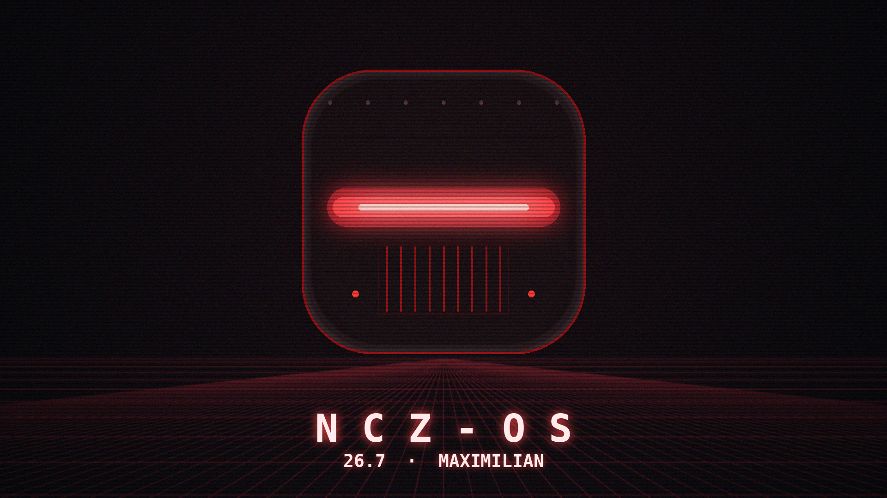

<p align="center">
  
</p>

# NCZ-OS 26.7 "Maximilian" — installer 2026.08.18-v12

Arm64 Linux for CIX Sky1 boards, with the GPU, NPU and VPU actually working.

| | |
|---|---|
| ISO | `nclawzero-installer-cixmini-2026.08.18-v12.iso` |
| md5 | `5dff7a2635c3146da2288fd911f88816` |
| size | 3.4 GB |
| kernel | `7.2.0-sky1-ncz` |
| base | Debian forky (testing), arm64 |
| desktop | Singularity (labwc / wlroots, native Mali GLES) |

## Validated hardware

| Board | Status |
|---|---|
| **Radxa Orion O6N** | Install, boot and accelerators validated |
| **Minisforum MS-R1** | Install, boot and accelerators validated |
| **Orange Pi 6** | In progress — expected within two weeks |

## What works

**GPU** — Mali-G720-Immortalis via `mali_kbase`, 10 cores, OpenGL ES 3.2,
EGL 1.5. The desktop is genuinely accelerated.

**NPU** — Zhouyi V3, 3 cores. Embedding inference at ~95 ms per 256-token
chunk, deterministic across runs. Install a model package to use it (see
below).

**VPU** — Linlon v5276, 4 cores. Hardware decode for H.263, H.264, HEVC,
MPEG-2, MPEG-4, VP8, VP9 and AV1; hardware encode for H.264, HEVC, VP8 and
VP9. Wired into `ffmpeg` through V4L2 mem2mem.

**Display** — Linlon-D60, DisplayPort up to 4K60.

**Audio** — PipeWire on the Sky1 sound card, HDMI/DP output.

**Networking** — Realtek 2.5 GbE. WiFi and Bluetooth firmware ships for
MediaTek, Broadcom/AMPAK, Qualcomm Atheros and Intel modules, so most M.2
radios work out of the box.

**USB Type-C** — data, storage and Power Delivery all work. A USB-C drive
attached to an O6N enumerates normally, and PD is live: the `rts5453` driver
binds and `/sys/class/typec/port0` reports `usb_power_delivery_revision 3.0`,
`usb_typec_revision 1.2`, `power_role [source]`, `vconn_source yes`.
`module_blacklist=typec_rts5453,rts5453` still appears on the boot cmdline but
is **inert** — the driver is built in, and `module_blacklist` only affects
loadable modules. Alt-mode (DisplayPort-over-Type-C) is not wired up.

## Installing

<p align="center">
  
  <br><em>The rEFInd launch screen</em>
</p>

Write the ISO to a USB stick and boot it. The installer is unattended — it
picks the target disk, installs the base system, drivers and desktop offline
from the image, and reboots into a working system. The base system comes off
the media, so no package resolution mid-install can fail on a flaky link or an
unreachable mirror — but that is not the same as fully offline: some
post-install steps use apt, and a few optional components fetch from the
network. Connect wired Ethernet before powering on.

The boot menu also offers a rescue shell and a serial-trace diagnostic entry
(O6/O6N, `ttyAMA0`, 115200).

## Remote access defaults

This image enables **telnet (port 23, plaintext, root)**, a failsafe root
console on **2323**, SSH with password authentication and root login
permitted, and a **recovery container with its own IP on your LAN**.

They are lockout recovery for headless boards with no reliable serial console.
On any untrusted network, disable them:

```bash
sudo systemctl disable --now openbsd-inetd ncz-failsafe.service \
                              systemd-nspawn@ncz-recovery.service
sudo systemctl mask ncz-failsafe.service systemd-nspawn@ncz-recovery.service
```

Full detail, including SSH hardening and how to verify:
**[docs/REMOTE-ACCESS.md](../REMOTE-ACCESS.md)**

## Embedding models

Models are **not** on the ISO — they are several hundred megabytes each and
most installs do not need one. `/opt/ncz/models` is empty after installation.

Install one from the apt repo when you want NPU inference:

```
sudo apt install ncz-model-nomic-embed   # 768-dim, the default
```

Until a model is installed, NPU inference fails with `noe_load_graph`. That is
a missing model, not a hardware or driver problem. Available tiers are
documented in [docs/EMBEDDING-MODELS.md](../EMBEDDING-MODELS.md).

## Kernel

26.7 ships **one** kernel, `7.2.0-sky1-ncz`. Earlier releases carried an
additional 7.0.12 channel; it has been removed from the image.

## Source

NCZ-OS builds several components from modified source. Everything we compile
is indexed in [docs/SOURCE-RELEASES.md](../SOURCE-RELEASES.md), and the
complete corresponding source for the shipping kernel is in
[`kernel-source/`](../../kernel-source/SOURCE.md).
